# 🎙️ EchoDiary

**An AI-powered voice diary and emotional companion that listens, remembers, and cares.**

> 🏆 **Winner - First Place** at [Voice AI Hackathon 2025]

EchoDiary is a voice-first journaling application that lets you share your thoughts and feelings through natural phone conversations. It uses advanced AI to understand your emotions, build a knowledge graph of your life, and provide empathetic responses in real-time.

---

## ✨ Features

### 🗣️ **Natural Voice Conversations**
- Call EchoDiary like a friend - no app installation required
- Real-time speech-to-text and text-to-speech
- Natural, empathetic AI responses powered by OpenAI GPT

### 🧠 **Knowledge Graph**
- Automatically extracts entities (people, places, topics, emotions) from your conversations
- Builds relationships between entities over time
- Visual knowledge graph to see connections in your life

### 📊 **Mood Tracking**
- AI-powered mood analysis (1-10 scale) from your voice
- Track emotional patterns over time
- Historical mood graphs and statistics

### 💬 **Multiple Conversation Modes**
- **Reassure Mode**: Warm, supportive responses for difficult times
- **Tough Love Mode**: Direct, motivational feedback when you need a push
- **Listener Mode**: Gentle acknowledgment, lets you talk it out

### 📞 **Smart Check-ins**
- Automatic follow-up when mood drops below threshold
- Scheduled check-ins via SMS or voice call
- Personalized messages based on your history

### 📱 **Web Dashboard**
- View all your call history
- Interactive knowledge graph visualization
- Mood statistics and trends
- Individual call transcripts

---

## 🏗️ Architecture

```mermaid
flowchart TB
    User[👤 User Phone Call]
    
    subgraph Layercode["🔊 Layercode Voice Pipeline"]
        Twilio[📞 Twilio<br/>Voice Gateway]
        Deepgram[🎤 Deepgram<br/>Speech-to-Text]
        Rime[🔊 Rime AI<br/>Text-to-Speech]
    end
    
    subgraph Backend["🖥️ EchoDiary Backend (FastAPI)"]
        Webhook[📡 Webhook Handler]
        GPT[🤖 OpenAI GPT<br/>Response Generation]
        Redis[⚡ Redis<br/>Session Management]
        
        subgraph Processing["Background Processing"]
            Entity[🧩 Entity Extraction]
            Mood[😊 Mood Analysis]
            CheckIn[⏰ Check-in Scheduler]
        end
        
        DB[(💾 SQLite Database)]
    end
    
    subgraph Frontend["🌐 Web Dashboard"]
        Home[🏠 Home Page]
        Graph[🕸️ Knowledge Graph]
        Stats[📊 Statistics]
    end
    
    User -->|Voice Call| Twilio
    Twilio -->|Audio Stream| Deepgram
    Deepgram -->|Transcript| Webhook
    
    Webhook -->|Get Context| Redis
    Webhook -->|Generate Response| GPT
    GPT -->|Response Text| Rime
    Rime -->|Synthesized Audio| Twilio
    Twilio -->|Audio| User
    
    Webhook -->|Store Transcript| DB
    Webhook -->|Trigger| Entity
    Webhook -->|Trigger| Mood
    
    Entity -->|Extract & Store| DB
    Mood -->|Calculate & Store| DB
    Mood -->|Schedule if needed| CheckIn
    
    CheckIn -->|Send SMS/Call| Twilio
    
    Frontend -->|Read Data| DB
    Frontend -->|Display| User
```



### Technology Stack

**Voice Pipeline (Handled by Layercode):**
- **Twilio** - Phone call infrastructure
- **Deepgram** - Speech-to-text transcription
- **Rime AI** - Expressive text-to-speech

**Backend:**
- **FastAPI** - High-performance web framework
- **OpenAI GPT** - Conversational AI and entity extraction
- **Redis (Upstash)** - Session management and real-time context
- **SQLAlchemy** - Database ORM
- **SQLite** - Persistent data storage
- **APScheduler** - Background task scheduling

**Frontend:**
- Vanilla HTML/CSS/JavaScript
- D3.js for knowledge graph visualization

---

## 🚀 How It Works

### 1️⃣ **You Call In**
When you dial EchoDiary's number, Layercode routes your call through their voice pipeline:
- Twilio receives your call
- Deepgram transcribes your speech in real-time
- Transcript is sent to EchoDiary backend via webhook

### 2️⃣ **AI Responds**
EchoDiary processes your message:
1. Retrieves your conversation history from Redis (last 3 turns)
2. Generates contextual response using OpenAI GPT
3. Sends response back to Layercode
4. Rime converts text to natural-sounding speech
5. Twilio plays audio back to you

### 3️⃣ **Background Magic**
After the call ends, EchoDiary:
- Extracts entities (people, places, emotions, topics) using GPT
- Builds relationships in your knowledge graph
- Calculates your mood score (1-10 scale)
- Schedules check-in if mood is concerning

### 4️⃣ **Review & Reflect**
Visit the web dashboard to:
- See your call history with transcripts
- Explore your interactive knowledge graph
- Track mood trends over time
- Review what you talked about

---

## 📋 Prerequisites

- Python 3.10+
- Redis instance (we recommend [Upstash](https://upstash.com/) free tier)
- OpenAI API key
- Layercode account with:
  - Twilio phone number
  - Deepgram API key
  - Rime AI API key

---

## ⚙️ Installation

### 1. Clone the Repository
```bash
git clone https://github.com/yourusername/echodiary.git
cd echodiary
```

### 2. Create Virtual Environment
```bash
python -m venv venv

# Windows
venv\Scripts\activate

# Mac/Linux
source venv/bin/activate
```

### 3. Install Dependencies
```bash
pip install -r requirements.txt
```

### 4. Configure Environment Variables
Create a `.env` file in the root directory:

```env
# Application
APP_NAME=EchoDiary
DEBUG=false
HOST=0.0.0.0
PORT=8000

# Database
DATABASE_URL=sqlite+aiosqlite:///./echodiary.db

# Redis (Upstash)
UPSTASH_REDIS_URL=your_upstash_redis_url
UPSTASH_REDIS_TOKEN=your_upstash_redis_token

# OpenAI (Required)
OPENAI_API_KEY=your_openai_api_key

# Layercode (Optional - for direct integration)
LAYERCODE_API_KEY=your_layercode_api_key
```

See `env_example.txt` for full configuration options.

### 5. Initialize Database
```bash
python -m app.database
```

### 6. Run the Application
```bash
uvicorn app.main:app --reload
```

The app will be available at `http://localhost:8000`

---

## 🔧 Layercode Configuration

### Configure Your Layercode Pipeline

1. **Webhook URL**: Point Layercode to your deployed backend
   ```
   https://your-domain.com/layercode/webhook/transcript
   ```

2. **Expected Events**:
   - `session.start` - Call begins
   - `message` - User speaks (transcript)
   - `session.end` - Call ends

3. **Response Format**: EchoDiary returns Server-Sent Events (SSE) stream
   ```json
   data: {"type": "response.tts", "content": "Response text", "turn_id": "..."}
   data: {"type": "response.end", "turn_id": "..."}
   ```

---

## 📱 Usage

### Making a Call
1. Dial your Layercode phone number
2. Wait for the welcome message
3. Start talking! EchoDiary will respond naturally
4. Hang up when you're done

### Web Dashboard
Navigate to:
- **Home** (`/`) - View all calls
- **Call Details** (`/call.html?id=X`) - See transcript and details
- **Knowledge Graph** (`/graph.html`) - Visualize your entities
- **Statistics** (`/stats.html`) - View mood trends

---

## 🗂️ Project Structure

```
echodiary/
├── app/
│   ├── main.py                 # FastAPI application entry point
│   ├── config.py              # Configuration management
│   ├── database.py            # Database setup
│   ├── models.py              # SQLAlchemy models
│   ├── schemas.py             # Pydantic schemas
│   ├── redis_client.py        # Redis session management
│   ├── tasks.py               # Background processing tasks
│   ├── routes/
│   │   ├── api.py            # REST API endpoints
│   │   ├── cron.py           # Scheduled tasks
│   │   └── layercode.py      # Layercode webhook handlers
│   └── services/
│       ├── openai_service.py  # OpenAI integration
│       └── layercode_service.py # Layercode integration
├── static/
│   └── css/
│       └── style.css          # Styling
├── templates/
│   ├── index.html            # Home page
│   ├── call.html             # Call details page
│   ├── graph.html            # Knowledge graph visualization
│   └── stats.html            # Statistics page
├── audio_recordings/         # Stored audio files
├── requirements.txt          # Python dependencies
├── .env                      # Environment variables (create this)
└── README.md                 # You are here!
```

---

## 🔌 API Endpoints

### Layercode Webhooks
- `POST /layercode/webhook/transcript` - Main webhook for all events
- `POST /layercode/webhook/call-start` - Call start handler
- `POST /layercode/webhook/call-end` - Call end handler

### Web API
- `GET /api/calls` - List all calls
- `GET /api/calls/{id}` - Get call details
- `GET /api/calls/{id}/transcript` - Get call transcript
- `GET /api/entities` - Get knowledge graph data
- `GET /api/stats` - Get mood statistics

### Health Checks
- `GET /health` - Application health
- `GET /layercode/health` - Webhook health

---

## 📊 Database Schema

### Core Tables
- **users** - User profiles and preferences
- **calls** - Call records with metadata
- **transcripts** - Turn-by-turn conversation history
- **entities** - Knowledge graph entities
- **relations** - Entity relationships
- **checkins** - Scheduled follow-up reminders

See `app/models.py` for detailed schema.

---

## 🤝 Contributing

We'd love your contributions! Here's how:

1. Fork the repository
2. Create a feature branch (`git checkout -b feature/amazing-feature`)
3. Commit your changes (`git commit -m 'Add amazing feature'`)
4. Push to the branch (`git push origin feature/amazing-feature`)
5. Open a Pull Request

---

## 🐛 Known Issues

- Knowledge graph visualization could use performance optimization for 100+ entities
- Check-in scheduler needs more robust error handling
- Audio file storage could benefit from cloud storage integration

---

## 🗺️ Roadmap

- [ ] Multi-language support
- [ ] WhatsApp integration
- [ ] Advanced sentiment analysis
- [ ] Voice emotion detection
- [ ] Export diary entries
- [ ] Mobile app
- [ ] Group therapy sessions
- [ ] Integration with mental health resources

---

## 📄 License

This project is licensed under the MIT License - see the [LICENSE](LICENSE) file for details.

---

## 🙏 Acknowledgments

- **Layercode** for the amazing voice pipeline platform
- **OpenAI** for GPT's incredible conversational abilities
- **Hackathon Organizers** for the opportunity and support
- **Our users** for trusting us with their stories

---

## 💬 Contact

Have questions? Want to chat about the project?

- **Email**: your-email@example.com
- **GitHub**: [@yourusername](https://github.com/yourusername)
- **Twitter**: [@yourhandle](https://twitter.com/yourhandle)

---

<div align="center">
  <b>Built with ❤️ for the Voice AI Hackathon 2025</b>
  <br>
  <sub>If EchoDiary helped you, consider giving it a ⭐️</sub>
</div>
